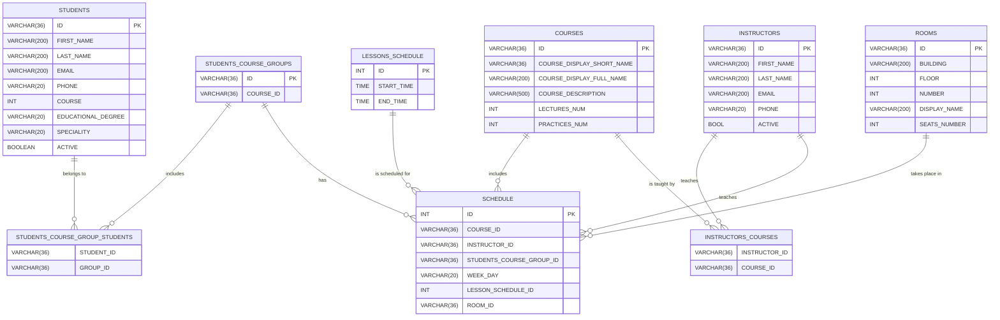

# Practical assignment 4

## The purpose of this task

Learn how to develop an operational database for a specific business application, understand the importance of data modeling, and apply optimization techniques for performance at scale.

You can work alone or in teams of up to 3 people. If working in a team, a joint presentation is required.

## Requirements

### Basic requirements (_for 15 points_):

| # | Requirement                                                                                   | Points |
| - | --------------------------------------------------------------------------------------------- | ------ |
| 1 | Build your own **operational database** for a business use case of your choice                | 2      |
| 2 | Use **entity relationships** (1:1, 1\:many, many\:many) appropriately                         | 2      |
| 3 | Implement **constraints**: `NOT NULL`, `UNIQUE`, `CHECK`, `FOREIGN KEY`, etc.                 | 2      |
| 4 | Use **indexes** for optimization (insert \~500,000 rows into at least one or more key tables) | 3      |
| 5 | Add **comments** on tables and their columns for documentation                                | 1      |
| 6 | Present an **ERD (Entity-Relationship Diagram)**                                              | 2      |
| 7 | Explain your solution using correct **database terminology**                                  | 2      |
| 8 | Demonstrate **good business understanding** of the domain and data                            | 2      |

## 🧠 Business Understanding Requirements (2 points)
Choose a business (e.g., e-commerce, hospital, logistics, education, etc.) and explain:

What problem the business is solving

What data entities are critical for its operation and why
Example: In an e-commerce platform, Orders, Customers, and Products are critical entities. You should be able to explain what KPIs this data supports (e.g., top-selling products, customer lifetime value).

### Additional points (_for 3 points_):
| # | Task                                                            | Points |
| - | --------------------------------------------------------------- | ------ |
| 1 | Create at least **3 different users** with different privileges | +1     |
| 2 | Create at least **1 view**                                      | +1     |
| 3 | Create a **stored procedure**                                   | +0.5   |
| 4 | Create a **trigger or function**                                | +0.5   |

Meeting the basic requirements of Practical Assignment 4 allows for a maximum of 15 points to be earned, and completing additional tasks listed under the heading "Additional points" can yield up to 3 extra points.

## Schedule Demo
### Database Schema

This is the database schema for the project (JUST AN EXAMPLE!!!):

##  ❓ 10 Questions About Database Modeling
1. What is the difference between OLTP and OLAP systems? Why is your solution OLTP? 
2. How would you choose primary keys and foreign keys for your tables? 
3. What are normalization and denormalization? Did you normalize your data? 
4. Why is indexing important, and how did it impact performance in your database? 
5. What are the risks of many-to-many relationships and how can you model them efficiently? 
6. Why are constraints like CHECK and UNIQUE important in a business context? 
7. How would you model historical data (e.g., price changes over time)? 
8. When would you use a view instead of a table? Give an example from your project. 
9. What’s the difference between a trigger and a stored procedure? 
10. What are some potential scalability issues you might face with your current design?